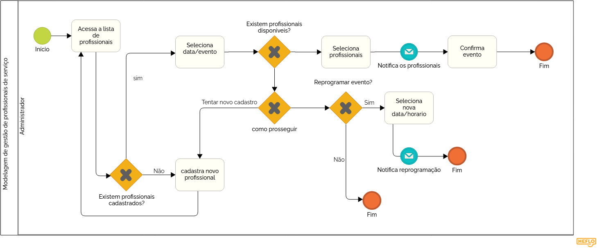

### 3.3.2 Processo 2 – GESTÃO DE PROFISSIONAIS DE SERVIÇO

Automatizar a verificação de disponibilidade dos profissionais e integrar notificações em tempo real, reduzindo conflitos de agenda e retrabalho na definição de equipes.

**Atividade: Cadastrar novo profissional**

| Campo         | Tipo           | Restrições                                  | Valor default |
| ------------- | -------------- | ------------------------------------------- | ------------- |
| nome_completo | Caixa de texto | obrigatório                                 | ---           |
| especialidade | Seleção única  | Fotógrafo, Cinegrafista, Editor, Assistente | ---           |
| email_contato | Caixa de texto | formato de e-mail                           | ---           |
| telefone      | Caixa de texto | formato (31) 99999-9999                     | ---           |

| Comando  | Destino                         | Tipo    |
| -------- | ------------------------------- | ------- |
| Salvar   | Atividade: Salva profissional   | default |
| Cancelar | Atividade: Exibir profissionais | cancel  |

------------------------------------------------------------------------------------

**Atividade: Seleciona data/evento**

| Campo        | Tipo           | Restrições                   | Valor default |
| ------------ | -------------- | ---------------------------- | ------------- |
| id_evento    | Seleção única  | lista de eventos cadastrados | ---           |
| data_evento  | Data           | leitura (dd-mm-aaaa)         | ---           |
| tipo_servico | Caixa de texto | leitura                      | ---           |

| Comando                   | Destino                                              | Tipo    |
| ------------------------- | ---------------------------------------------------- | ------- |
| Verificar Disponibilidade | Atividade: Consulta disponibilidade de profissionais | default |
| Voltar                    | Atividade: Acessa lista de profissionais             | cancel  |

------------------------------------------------------------------------------------

**Atividade: Seleciona profissionais (fotógrafo, cinegrafista, editor)**

| Campo                     | Tipo             | Restrições                                    | Valor default |
| ------------------------- | ---------------- | --------------------------------------------- | ------------- |
| profissionais_disponiveis | Seleção múltipla | somente profissionais sem conflito de horário | ---           |
| observacoes_escala        | Área de texto    | opcional                                      | ---           |

| Comando            | Destino                        | Tipo    |
| ------------------ | ------------------------------ | ------- |
| Confirmar Alocação | Atividade: Aloca profissionais | default |
| Reprogramar Evento | Atividade: Reprogramar evento  | cancel  |

------------------------------------------------------------------------------------

**Atividade: Notifica profissionais**

| Campo            | Tipo          | Restrições                     | Valor default |
| ---------------- | ------------- | ------------------------------ | ------------- |
| detalhes_servico | Área de texto | leitura (data, local, horário) | ---           |
| link_confirmacao | Link          | URL única para o profissional  | ---           |

| Comando             | Destino         | Tipo    |
| ------------------- | --------------- | ------- |
| Enviar Notificações | Fim do Processo | default |

------------------------------------------------------------------------------------

**Atividade: Reprogramar evento**

| Campo                | Tipo          | Restrições                      | Valor default              |
| -------------------- | ------------- | ------------------------------- | -------------------------- |
| nova_data            | Data          | deve ser posterior à data atual | ---                        |
| motivo_reprogramacao | Área de texto | obrigatório                     | falta de equipe disponível |

| Comando         | Destino                          | Tipo    |
| --------------- | -------------------------------- | ------- |
| Atualizar Data  | Atividade: Seleciona data/evento | default |
| Cancelar Evento | Fim do Processo                  | cancel  |
